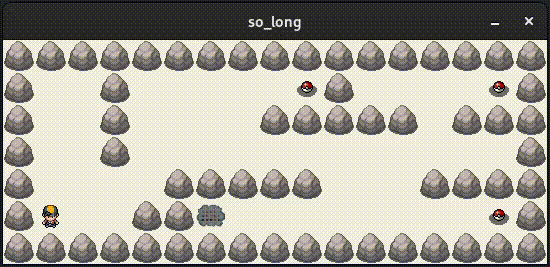

## Introduction

"So Long" is a 2D game developed in C using the MiniLibX graphics library. This document provides an overview of the game from a developer's perspective, including how to build and run the game, the structure of the code, and how to extend the game with new features.
<div align="center">
	
</div>

## Building the Game

To build the game, you must use a stable version of linux with a graphical environment such as [GNOME](https://wiki.gnome.org/Projects/GnomeShell/Extensions/StepByStepTutorial#Installing_GNOME_Shell_Extensionsand) and have the X11 library installed on your system. Once you have that, you can build the game by running the `make` command in the root directory of the project. This will generate an executable named `so_long`.

## Running the Game

To run the game, use the following command:

```
./so_long map.ber
```

Replace `map.ber` with the path to the map file you want to play. You can find some in the [maps](./maps) repository.

## Code Structure

The game's code is organized into several files:

- `main.c`: Contains the `main` function which initializes the game and starts the game loop on.
- `checks.c`: Contains functions for handling error inputs (missing argument, invalid maps).
- `display.c`: Contains functions for drawing the game state to the screen.
- `quit.c`: Contains the `ft_quit` function which exits the program safely by freeing all used data.
- `utils.c`: Contains utility functions used by other parts of the code.


## User Experience

The game is controlled using the arrow keys or `W`, `A`, `S`, `D` keys. The goal of the game is to collect all the collectibles and reach the exit. The game keeps track of the number of moves the player makes, with the aim to complete the game in as few moves as possible.

## Source Code

The source code for "So Long" is available on GitHub. You can clone the repository using the following command:

```sh
git clone https://github.com/username/so_long.git
```

Replace `username` with your GitHub username.

## Conclusion

"So Long" is a valuable game that provided an excellent platform for enhancing my C programming and game development skills. By working on this project, I have strengthened my understanding of C language concepts, improved my problem-solving abilities, and gained hands-on experience in game development.
