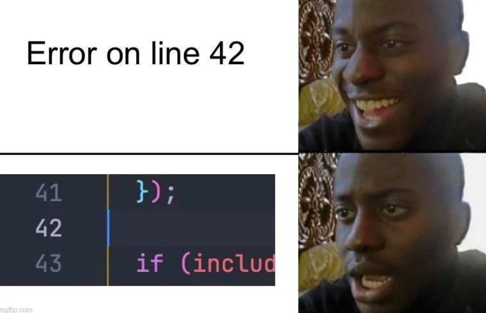

# My 42 Journey

Hey there! I'm Marin, a student at [42 Paris](https://42.fr) since Nov 2023. This repo is here to share all of my projects made at 42. 

## DevOps Projects

- 🐳 [**Inception**](./devops/inception/) - I containerized a full wordpress application using `docker compose`.

- 🌱 [**Born2beroot**](./devops/born2beroot/) - I set up a secure Linux server environment following strict guidelines.

- 🛜 [**NetPractice**](./devops/netpractice/) - I learnt how to connect small-scale networks using IPs and masks.

## Web Projects
- 🤵‍♂️ [**webserv**](./https://github.com/42mates/webserv/) - A NGINX-inspired HTTP web server.

## System Projects
- 🐚 **Shell**: 
	- [**minishell**](https://github.com/42mates/minishell/) - A basic reproduction of `bash` (group project with [@ku-alexej](https://github.com/ku-alexej)).
	- [**pipex**](./system/pipex/) - A program reproducing the pipe '`|`' behavior.

- 🧵 [**Philosophers**](./system/philosophers/) - An introduction to threads and mutexes through the classic dining philosophers problem.

- ♻️ [**push_swap**](./system/push_swap/) - A sorting algorithm following restricted operations.

- 🕹️ **Graphics**:
	- [**cub3D**](https://github.com/42mates/cub3D) - A 3D game using raycasting techniques, inspired by the classic game Wolfenstein 3D (group project with [@ku-alexej](https://github.com/ku-alexej)).
	- [**so_long**](./system/so_long/) - A Pokemon Heartgold-like desktop minigame using the X11 framework.  

- 📦 [**CPP Modules**](./system/cpp-modules/) - Ten modules to learn Object-Oriented Programming through C++98.

- 🐣 **Basic C functions**:
	- [**Piscine**](./system/piscine/) - Gotta start somewhere! I learned the basics of C and Shell.
	- [**libft**](./system/libft/) - I built my own basic C library.
	- [**ft_printf**](./system/printf/) - I created my own implementation of printf.
	- [**get_next_line**](./system/get_next_line/) - Unlocked the magic of reading files line by line!

## Contact

For any further information, feel free to contact me on [hello@marinbecker.me](mailto:hello@marinbecker.me) and go take a look at [my website](https://www.marinbecker.me)!

<!--## Still here ?!

You manage to read this entire presentation, congrats !   
Here's a cool meme for you to look at :

	

-->