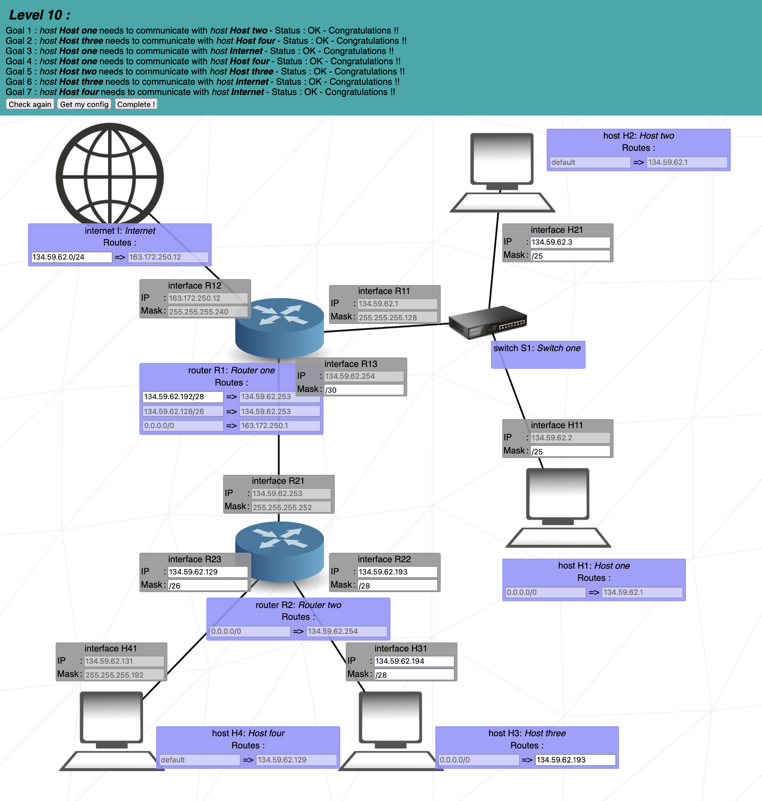

# NetPractice

This project is part of the 42 curriculum and focuses on understanding and configuring computer networks.

## Objectives

- Learn the basics of IP addressing and subnetting.
- Configure network interfaces and routing.
- Understand and implement network services.

## Project Structure

The project is divided into 10 levels, with increasing complexit. 
- _Levels 1, 2, 3_: understanding IP addresses and subnet masks in a single local network
- _Levels 4, 5_: connecting a network to the router
- _Levels 6, 7, 9, 10_: creating different subnetworks and ensuring they can communicate with each other and the internet.

The evaluation for this project focuses only in levels 6 and above.

## Example

The following image shows an example of a network configuration for level 10.

	

