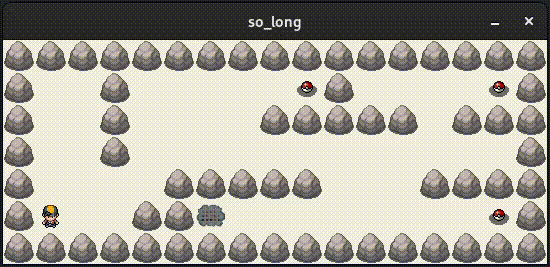

## Introduction

`so_long` is a 2D game developed in C using the MiniLibX graphics library. This document provides an overview of the game from a developer's perspective, including how to build and run the game, the structure of the code, and how to extend the game with new features.
<div align="center">
	
</div>

## Building the Game

To build the game, you must use a stable version of linux with a graphical environment such as [GNOME](https://wiki.gnome.org/Projects/GnomeShell/Extensions/StepByStepTutorial#Installing_GNOME_Shell_Extensionsand) and have the X11 library installed on your system. Once you have that, you can build the game by running the `make` command in the root directory of the project. This will generate an executable named `so_long`.

Replace `map.ber` with the path to the map file you want to play. You can find some in the [maps](./maps) repository.

## Code Structure

The game's code is organized into several files:

- `main.c`: Contains the `main` function which initializes the game and starts the game loop on.
- `checks.c`: Contains functions for handling error inputs (missing argument, empty/open/unplayable maps).
- `display.c`: Contains functions for drawing the game state to the screen.
- `quit.c`: Contains the `ft_quit` function which exits the program safely by freeing all used data.
- `utils.c`: Contains utility functions used by other parts of the code (is_blocked, get_xy...).


## User Experience

The game is controlled using the arrow keys or `W`, `A`, `S`, `D` keys. The goal of the game is to collect all the collectibles and reach the exit. The game keeps track of the number of moves the player makes, with the aim to complete the game in as few moves as possible. The program exits at the end of the game or at any moment by pressing `Esc` or by clicking the window's `x` button.


## Try Me !

First, download the source code, either by cloning the entire repository:
```bash
git clone git@github.com:marinsucks2.git
```

or by cloning this subdirectory only:
```bash
mkdir 42-so_long && cd 42-so_long

# Initialize Git and add this remote repository.
git init && git remote add -f origin git@github.com:marinsucks/42.git

# Configure Git to only fetch so_long from the remote repository.
git config core.sparseCheckout true && echo "system/so_long" >> .git/info/sparse-checkout

git pull origin master
```
⚠️ Make sure you are using a Linux desktop environment like GNOME, and you meet the MinilibX requirements:

> Requirements for Linux:
>  - MinilibX only support TrueColor visual type (8,15,16,24 or 32 bits depth) 
> - gcc
> - make
> - X11 include files (package xorg)
> - XShm extension must be present (package libxext-dev)
> - Utility functions from BSD systems - development files (package libbsd-dev)  
>   
For example: `sudo apt-get install gcc make xorg libxext-dev libbsd-dev (Debian/Ubuntu)`  


Create the program and run the game with any valid .ber map:
```bash
make all && ./so_long maps/ex3.ber
```

...and have fun!! 